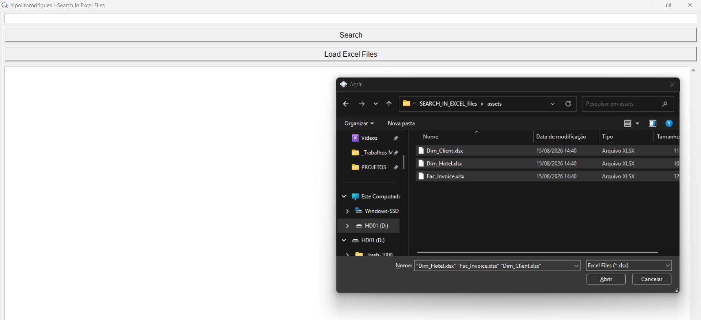
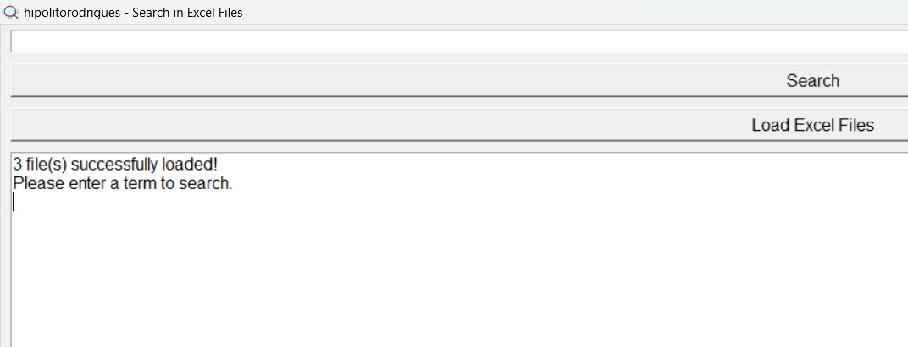
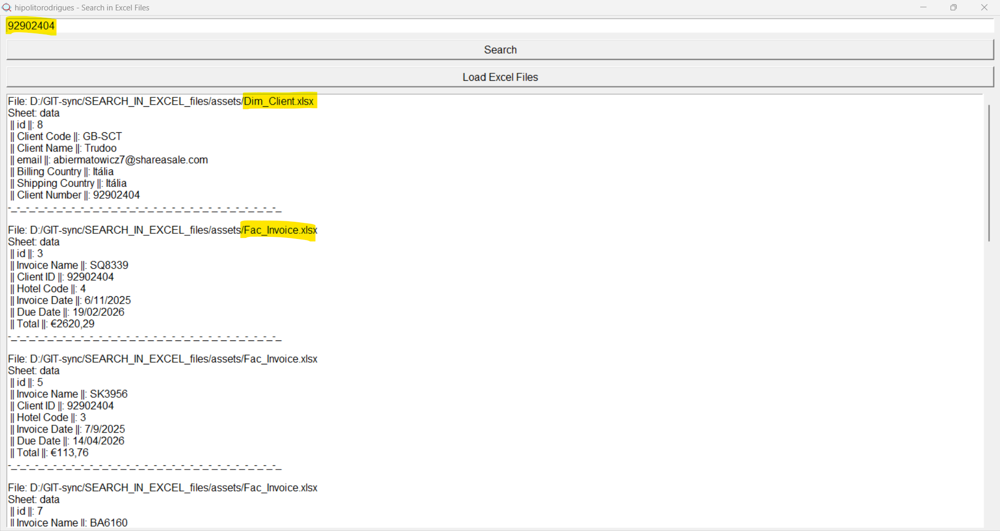

# Search in Excel Files

## About the Project

**Search in Excel Files** is a desktop application developed in **Python 3.13.1** using the **Tkinter** library for the graphical interface. Its purpose is to allow users to load multiple **.xlsx** files and search across all their sheets, displaying the results in an organized manner.



## Features

- **Load multiple Excel (.xlsx) files simultaneously**
- **Search for a term in all sheets of all loaded files**
- **Display formatted results in the graphical interface**
- **Responsive and user-friendly interface**





## Technologies Used

- **Python 3.13.1**
- **Tkinter** - Graphical interface
- **Pandas** - Data manipulation for Excel files

## How to Run

**METHOD 1**
1. Make sure you have Python 3.13.1 installed.
2. Install the necessary dependencies by running:
   ```sh
   pip install -r requirements.txt
   ```
3. Run the application with the command:
   ```sh
   python main.py
   ```

## How to Use

1. **Open the application** - Run the `main.py`.
2. **Load files** - Click the **"Load Excel Files"** button and select the desired files.
3. **Perform a search** - Enter a term in the search field and click the **"Search"** button.
4. **View results** - The results will be displayed in the text area of the interface, showing:
   - The file where the term was found
   - The corresponding sheet
   - The row containing the found term

## Code Structure

The project follows **SOLID** principles, using the **MVC (Model-View-Controller)** pattern:

- **Model:** `ExcelSearchApp` class, which manages the loaded files and search logic.
- **View:** `create_widgets()` module, which defines the graphical interface elements.
- **Controller:** `load_files()` and `search()` methods, which handle user interactions and file searches.

## Possible Future Improvements

- Add support for **.csv** and **.xls** files.
- Option to export search results to a text or Excel file.
- Interface improvements using **ttk** for a more modern design.

## Author

- **Developer**: @hipolitorodrigues
- **Creation Date**: 02/04/2025

---

## License

This project is licensed under the MIT License. This means you are free to use, copy, modify, merge, publish, distribute, sublicense, and/or sell copies of the software, as long as you retain the original copyright notice and include the license in all copies or substantial portions of the software.
